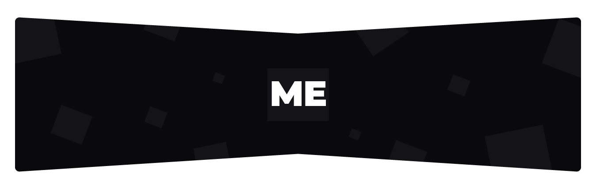
<h1 align="center">Mohamed ELYOUSFI</h1>
<h2 align="center"><💻 Compte Rendu des Travaux Pratiques Micro-Services💻/></h2>  

    
Activité Pratique N° 3 : Web services SOAP, WSDL, UDDI avec JAXWS

    

        

            <b>SOAP</b> (Simple Object Access Protocol) : crée pour pouvoir connecter les systemes distribuées et les permettre echanger des messages en format xml et trasformé en format http. 
            <b>
                **Dans SOAP il ya que la methode POST
            </b>
        

        

            <b>JaxWS</b> : specification qui permet de cree et consommer les webservices cree avec SOAP.
        

        

            <b>WSDL</b> (Web Service Description Language) : description de webservice (nom des methodes, params, ...) se fait en format xml en utilisant WSDL.
        

        

            <b>UDDI</b> (Universal Description, Discovery and Integration) : annuaire des addreses des WebServices.
        

        

            <b>JaxRS</b> : pour les WebServices basé sur REST.
        

        

            <b>JaxB</b> : mappage object xml.
        

        <h5>JaxWS Dependency</h5>
        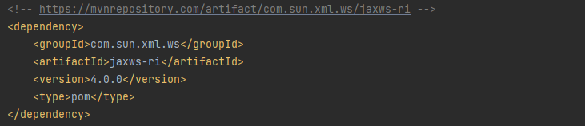
        <h5>Création du ServeurWS (BanqueWS)</h5>
        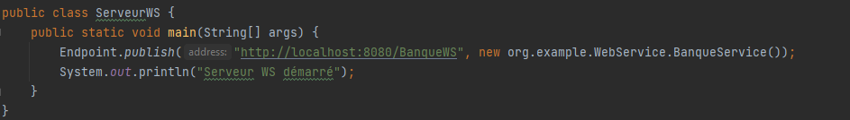
        <h5>Création de la classe Compte</h5>
        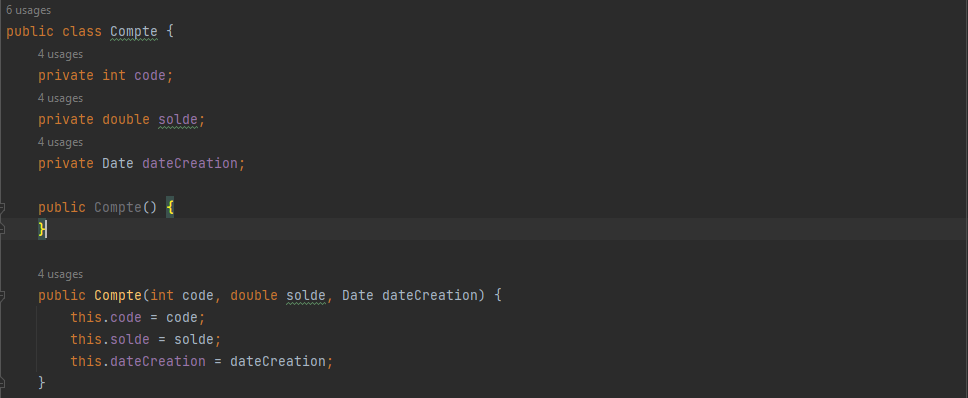
        <h5>Création du BanqueService</h5>
        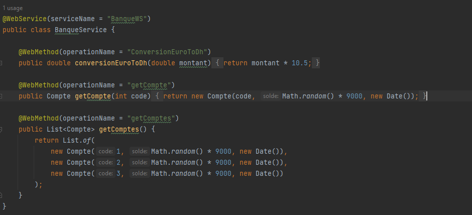
        <h5>WSDL dans Google Chrome</h5>
        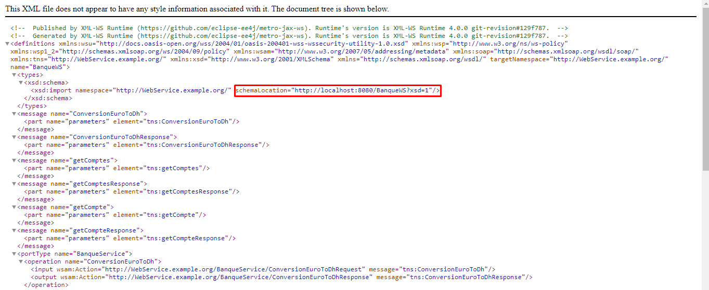
        <h5>Schema du Web Service</h5>
        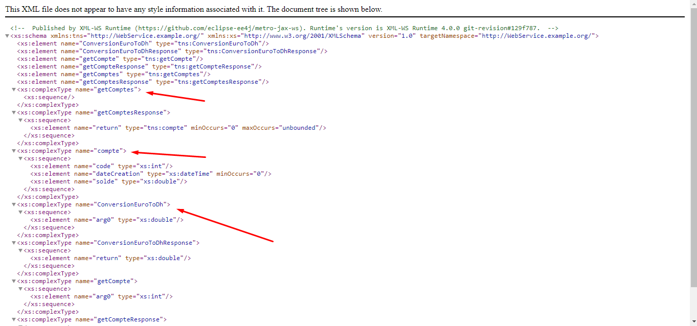
        <h5>SoapUI - ConversionEuroToDH</h5>
        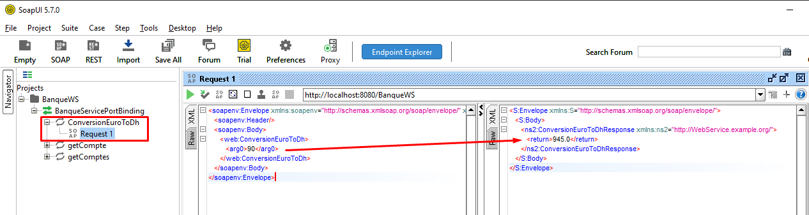
        <h5>SoapUI - GetCompte</h5>
        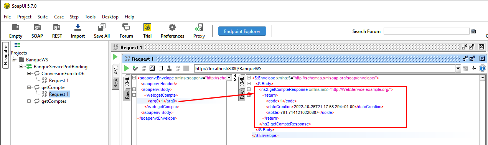
        <h5>SoapUI - GetComtpes</h5>
        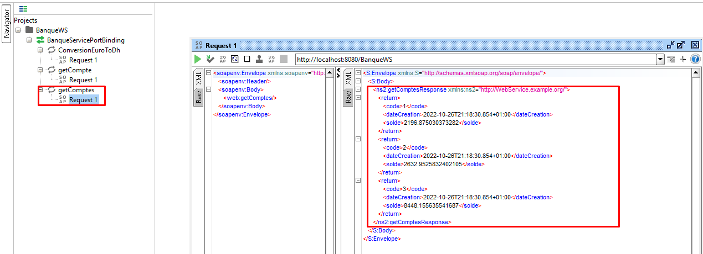
        <h5>Client SOAP - java</h5>
        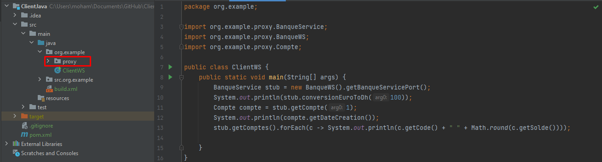
        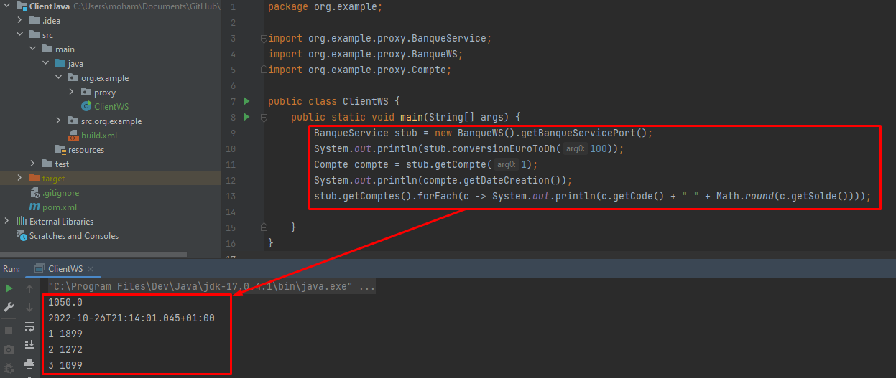
        <h5>Client SOAP - .NET</h5>
        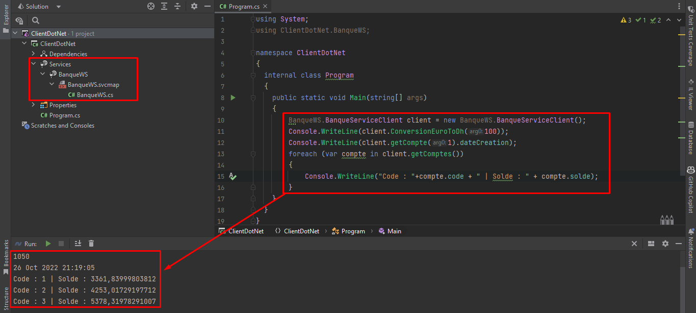
        <h5>Client SOAP - PHP</h5>
        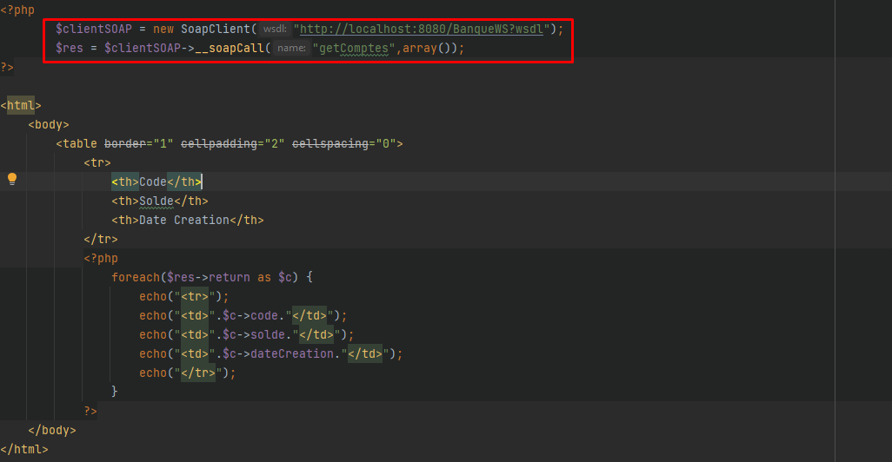
        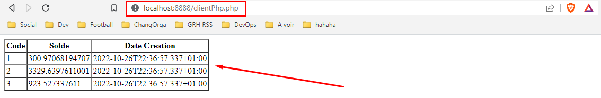

<!--  -->